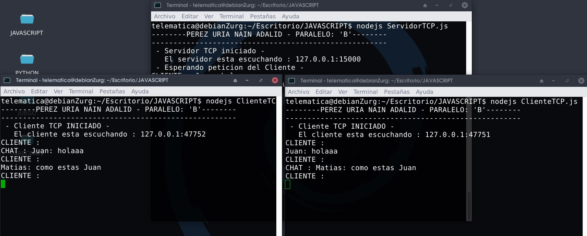

# CHAT
### Construcción de un CHAT usando Sockets.
**_En esta primera captura se tiene ejecutando el servidor del CHAT y ademas dos clientes que interactuaran entre ellos_**

  

**_En esta segunda captura se tiene interactuando los dos clientes en el chat, en el que cada cliente debera ingresar su nombre por cada mensaje enviado para que cada cliente reconozca quien escribe en el chat_**

  

**_En esta tercera captura se incorpora un nuevo cliente en el que tambien interactua con el chat_**

  

